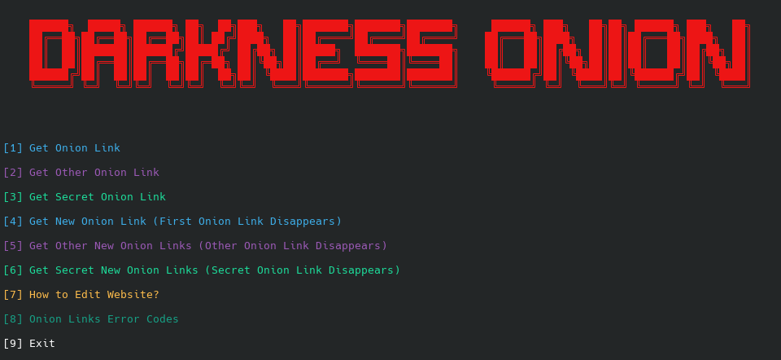

# Generate Endless Onion Links

    

## Installation

```bash
sudo apt install tor -y
```

```bash
git clone https://github.com/BurakTuysuz/DarknessOnion.git
```

## Usage

```bash
cd DarknessOnion
```

```bash
sudo python3 darknessonion.py
```



## Requirements

For Debian and Debian-based distributions only
(Kali Linux, Parrot OS, Ubuntu, Debian etc.)


## Legal Disclaimer


This tool was created for education. The producer is not responsible for incorrect use. You agree that you use this software at your own risk. 
